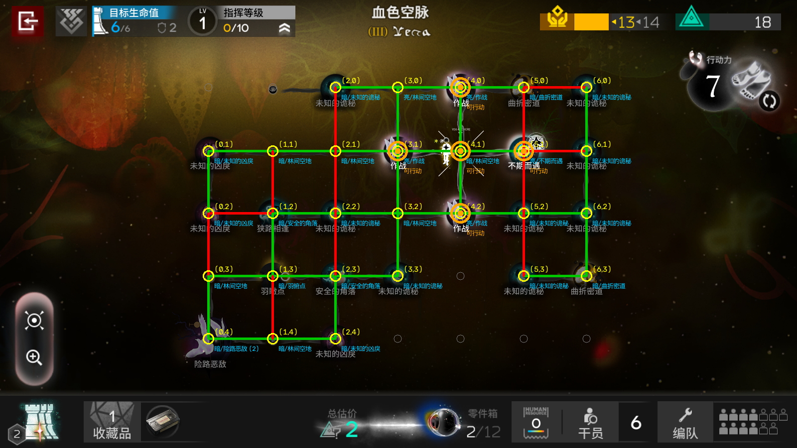

# 黑流树海 路线识别（Black Flow Sea Route Recognition）

> ⚠️ **使用须知（必读）**
> - **识别非 100% 准确**：本工具基于录屏运动分析，复杂特效/光照下可能误判（尤其节点类型）。**使用前请以游戏内实际画面为准**，因误判造成的损失请自行承担
> - **适用前提**：黑流树海肉鸽 **前三层** + **徒步模式** + 无实托邦（大范围烟雾）影响；模拟器分辨率必须 **1600x900**；录屏 20 秒内请勿操作游戏
> - **自备素材**：本仓库**不含游戏素材**，需按下方「自备素材」说明准备节点图标，否则无法识别
> - **处理耗时**：录屏 20 秒 + 判定约 30-40 秒，全程约 **1 分钟**
> - 仅供个人学习研究使用，请勿用于商业用途

明日方舟「黑流树海」肉鸽地图的**自动路线识别工具**：连接 MuMu 模拟器，录屏 20 秒，自动输出整张地图的路网——哪些节点之间有路、哪些节点可行动（高亮）、你在哪、每条边的判定依据。


输出一张带标注的路线图（绿=路 / 红=断 / 橙圈=可行动节点）+ 完整 JSON 数据，可直接喂给自动化脚本（如 MAA 自定义任务）。



## 特性

- **一键运行**：双击 `一条龙.bat`，自动连接模拟器 → 录屏 → 判路 → 弹出结果图
- **自动环境检测**：双击 `环境自检.bat` 自动发现 MuMu 安装目录、adb 端口、Python 环境
- **判路规则（v40.6）**：
  - 密度主段：路 = 一整条持续高密度的运动带（bin 密度 ≥8px 才算数，星星点点的特效不算）
  - 模板相关兜底：弱路相关度 ≥0.80
  - 大节点特判、你的位置排除（箭头文字飘动区）
  - 险路尽头/险路恶敌：节点持续动画污染周围边 → 排除节点区运动像素后宽松判定（相关 ≥0.75 或主段 ≥0.35）
- **输出完整**：路线图 PNG + 路网 JSON（网格/节点类型/亮节点/你的位置/边判定）+ 时间戳历史存档

## 识别范围（实测验证）

- **稳定识别**：黑流树海肉鸽 **前三层** + **徒步模式** + 无实托邦影响（画面无大面积烟雾）
- 实托邦局（节点被翻滚烟雾笼罩）：**路线识别也会受烟雾污染、变得不准确，节点识别更不准确**，不建议依赖
- 第四层及以上：未验证

## 自备素材（重要）

本仓库**不包含游戏素材**（版权原因）。识别需要节点图标素材库，请自行准备：

1. 在游戏中截取黑流树海地图（徒步模式，无实托邦影响）
2. 用截图工具把每个节点的图标**裁剪出来**（含光晕的完整图标，背景透明或暗色均可）
3. 按素材名放入对应文件夹：

| 文件夹 | 内容 |
|---|---|
| `识别素材/亮/` | 高亮（可行动/亮光）状态的节点图标 |
| `识别素材/暗/` | 普通（暗）状态的节点图标 |
| `text_templates/` | 节点下方的**名字文字**截图（可选，用于增强类型识别） |

4. 建议素材清单（尽量全，缺了对应节点会识别不出）：
   作战 / 紧急作战 / 失与得 / 未知的凶戾 / 未知的诡秘 / 林间空地 / 险路尽头 / 险路恶敌 / 险路小径 / 羽驻点 / 不期而遇 / 秘境行商 / 你的位置（含箭头版）/ 大节点 / 先行一步 / 得偿所愿 / 曲折密道 / 安全的角落 / 应急助力 / 狭路相逢 / 诡异行商 / 失入奇境 / 误入奇境

> 素材越多越全，节点识别越准。素材缺失时对应节点会显示为空格（当成没有绕过去），不会误判成别的节点。

## 环境要求

| 依赖 | 说明 |
|---|---|
| Windows 10/11 | 中文系统最佳（bat 为 GBK 编码） |
| MuMu 模拟器 12 或 15 | 明日方舟正常运行；adb 端口自动发现 |
| Python 3.8+ | 二选一：Windows Python 或 WSL（Ubuntu），需 opencv-python + numpy |
| 模拟器分辨率 | **必须 1600x900**（检测区域 mask 按此分辨率制作） |

## 安装

1. **下载本项目**，解压到任意目录（建议不要放 C:\Program Files 等需要管理员权限的位置）
2. **安装 Python 依赖**（二选一）：
   - Windows Python：`pip install opencv-python numpy`
   - 或 WSL：`sudo apt install python3-opencv python3-numpy`
3. **双击 `环境自检.bat`**：自动检测 MuMu 目录 / adb 端口 / Python，生成 `env.ini`
4. 完成，可以用了

## 使用

1. 打开 MuMu 模拟器，游戏进入黑流树海地图（徒步模式），**站着别动**
2. 双击 `一条龙.bat`
3. 按提示就位后按回车 → 自动录 20 秒 → 判路约 30 秒
4. 结果图自动弹出

### 输出文件（`输出\` 文件夹）

- `result_roads.png`：路线图（绿=路 红=断 橙圈=可行动节点 黄圈=节点类型）
- `result_roads.json`：路网数据（网格 / 节点类型 / 亮节点 / 你的位置 / 边判定 / 路列表）
- `历史结果\`：每次运行按时间戳存档

## 目录结构

```
├── 一条龙.bat          一键判路入口
├── 环境自检.bat        环境检测（首次使用）
├── 环境自检.ps1        自检逻辑（PowerShell）
├── 判路_v40终版.py     判路主程序
├── node_grid.py        网格/节点识别
├── 实托邦识别.py       实托邦（烟雾区）识别
├── road_templates.json 路形态模板
├── text_templates/     节点文字模板
├── 识别素材/           节点图标素材库（亮/暗）——**需自备**，见上文
├── 检测区域mask.png    检测区域掩码（1600x900）
├── 输出/               运行结果（自动创建）
└── env.ini             环境配置（环境自检生成）
```

## 已知限制

- 模拟器分辨率必须是 **1600x900**，否则节点定位会错位
- 判路依赖"烟雾运动"：录屏时游戏画面不能有操作（角色移动/菜单会污染）
- 实托邦（满屏烟雾）局：路线识别受烟雾污染会不准确，节点识别更不准确，不建议依赖
- 首次使用务必先跑 `环境自检.bat`

## 版权声明

- 本项目代码基于 MIT 协议开源
- `识别素材/` 与 `text_templates/` 中的图片为《明日方舟》游戏内素材的截图裁剪，**版权归上海鹰角网络科技有限公司所有**，仅供个人学习研究使用，请勿用于商业用途

## 声明

- 本项目由 **AI 辅助生成**，处于**实验性质**：**不保证长期维护，不保证兼容性**
- 欢迎 **fork** 和**二次开发**
- 期待贡献给 MAA 社区，方便舟友自动化黑流树海探索
